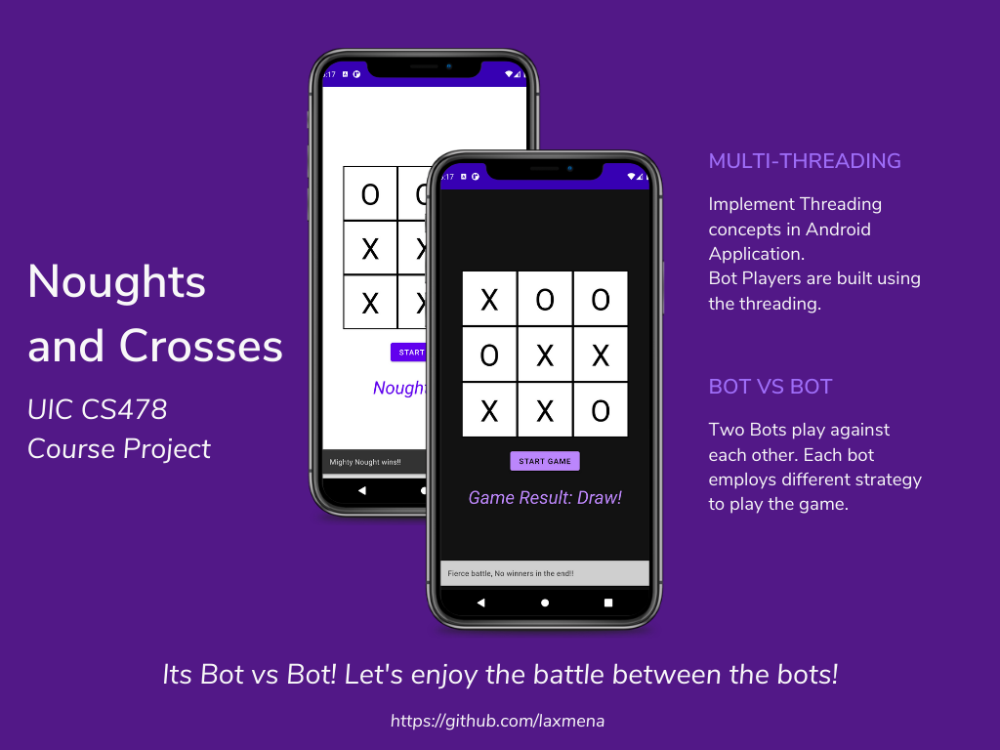
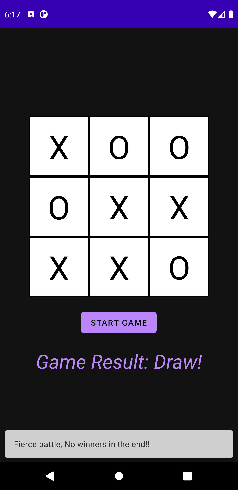

# Noughts and Crosses


## What's Noughts and Crosses?
Noughts and Crosses is a *Tic-Tac-Toe Android Application* created as part of **CS478 Software Development for Mobile Applications course** at **The University of Illinois at Chicago**. Two bots play against each other using different strategies, and we can spectate the exciting battle between the bots.

## Project Instructions
- Create a TicTacToe Andoird application where two bots play against each other.
- Each bot should use different strategies to make the next move.
- Use Threads to implement the two players/bots.

### Specification
- Android 11 - API Level 30

## Functionality
- App has a TicTacToe Board in the home screen and a start button.
- On clicking the start button, the two bots start to play against each other.
- **Player Cross** or **Bot1** uses **random strategy**: It plays its move randomly.
- **Player Nought** or **Bot2** employes **Greedy Strategy**: If there is an immediate opportunity to win or if there is an immediate threat, This bot plays in that position.

## How to build it?
1. Download or clone this repository using the following command
```
git clone https://github.com/laxmena/noughts_and_crosses.git
```
2. Open this project in Android Studio. 
3. Make sure the requirements are met, this app is tested using Samsung M30s and Pixel3XL devices.
4. Build and Run this app using a Emulator or Physical device.

## App Screenshots
**Portrait:**
<table>
    <tr>
        <td>
            Cross Wins <br/>
            
        </td>
        <td>
            Nought Wins <br/>
            
        </td>
        <td>
            Draw (Dark Mode) <br/>
            
        </td>
    </tr>
</table>


**Landscape:**
<table>
    <tr>
        <td>
            
        </td>
    </tr>
</table>

## Additional Information

If you have any questions, feedbacks, suggestions or recommendations, feel free to contact me through [Email](mailto:WriteTo@laxmena.com) or [LinkedIn](https://www.linkedin.com/in/lakshmanan-meiyappan/).

Check out my website and Blog here: [https://laxmena.com](http://laxmena.com/).

[](#)
